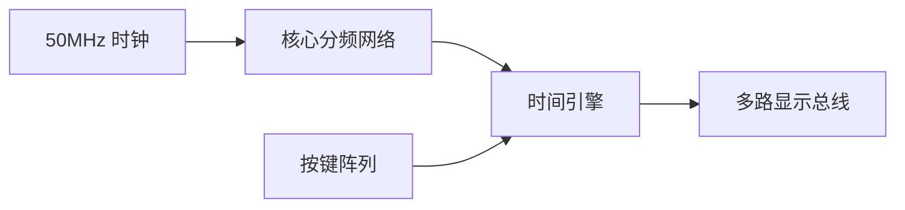
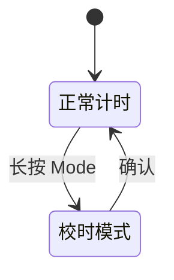

# 重新定义时间
基于 Verilog 的电子钟设计

%% 标题页 %%

---

## 极简。精准。
### 我们的目标

> [!quote] 
> “不只是一块表，而是时间的容器。”

- **24小时** 精确走时
- **一键** 极速校准
- **动态扫描** 优雅显示

%% 这里放置最终成品的效果图或概念图 %%
![[成品概念图.png|600]]

---

## 架构：少即是多
### 系统总体设计

一切从 50MHz 心跳开始。



---

## 拆解：四个核心
### 模块划分

> [!example] 模块化哲学
> 高内聚，低耦合。

1. **分频器 (Divider)**
2. **计数器 (Counter)**
3. **显示驱动 (Display)**
4. **控制中心 (Control)**

![[系统框图.png|600]]

---

## 降噪：寻找 1Hz 脉搏
### 时钟分频

从 50,000,000 到 1。
没有任何冗余。

```verilog
// 核心逻辑
if (cnt == 26'd24_999_999) begin
    cnt <= 0;
    clk_1hz <= ~clk_1hz;
end
```

---

## 律动：模运算的美学
### 计数逻辑

**60秒 · 60分 · 24小时**

全部同步设计。
零毛刺，纯粹的逻辑律动。

![[进位逻辑框图.png|500]]

---

## 残影：视觉的魔术
### 显示逻辑

1kHz 刷新率。
超越人眼极限的动态扫描。

| 位选 (单端点亮) | 段选 (七段译码) |
| :---: | :---: |
| 毫秒级轮询 | 极简 BCD-7 转换 |

---

## 掌控：瞬间回归
### 校时与复位

**按下。消抖。执行。**
20ms 硬件级防抖，告别无效跳动。

- **复位**：回归 00:00:00 的纯粹
- **校准**：精准对齐世界的刻度



---

## 洞察：看见波形
### 仿真验证

数据不会撒谎。

> [!success] 验证通过
> 进位无死角，时序完美闭环。

![[ModelSim_Waveform.png|800]]
%% 建议嵌入关键进位时刻的波形截图 %%

---

## 下一步：永不止步
### 总结与展望

这只是开始。

- **闹钟唤醒**
- **日历扩展**
- **RTC / GPS 赋能**

**让每一次跳动，都充满意义。**
