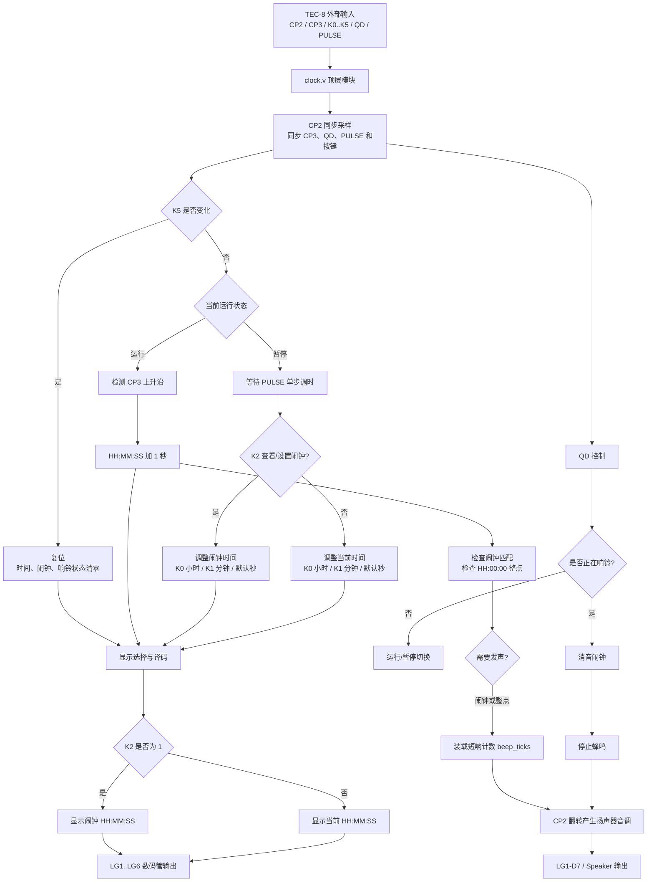

# TEC-8 电子钟工程流程图

下面的 Mermaid 图概括了本工程从外部输入到显示、蜂鸣输出的主要数据流和控制流。

如果粘贴到 Mermaid Live Editor 或其他在线渲染器，只复制代码块内部内容，不要复制 Markdown 标题、说明文字和代码围栏。

```mermaid
flowchart TD
    A["TEC-8 外部输入<br/>CP2 / CP3 / K0..K5 / QD / PULSE"] --> B["clock.v 顶层模块"]

    B --> C["CP2 同步采样<br/>同步 CP3、QD、PULSE 和按键"]
    C --> D{"K5 是否变化"}
    D -- "是" --> E["复位<br/>时间、闹钟、响铃状态清零"]
    D -- "否" --> F{"当前运行状态"}

    F -- "运行" --> G["检测 CP3 上升沿"]
    G --> H["HH:MM:SS 加 1 秒"]
    H --> I["检查闹钟匹配<br/>检查 HH:00:00 整点"]

    F -- "暂停" --> J["等待 PULSE 单步调时"]
    J --> K{"K2 查看/设置闹钟?"}
    K -- "是" --> L["调整闹钟时间<br/>K0 小时 / K1 分钟 / 默认秒"]
    K -- "否" --> M["调整当前时间<br/>K0 小时 / K1 分钟 / 默认秒"]

    C --> N["QD 控制"]
    N --> O{"是否正在响铃?"}
    O -- "是" --> P["消音闹钟"]
    O -- "否" --> Q["运行/暂停切换"]

    I --> R{"需要发声?"}
    R -- "闹钟或整点" --> S["装载短响计数 beep_ticks"]
    P --> T["停止蜂鸣"]
    S --> U["CP2 翻转产生扬声器音调"]
    T --> U

    E --> V["显示选择与译码"]
    H --> V
    L --> V
    M --> V
    V --> W{"K2 是否为 1"}
    W -- "是" --> X["显示闹钟 HH:MM:SS"]
    W -- "否" --> Y["显示当前 HH:MM:SS"]
    X --> Z["LG1..LG6 数码管输出"]
    Y --> Z
    U --> AA["LG1-D7 / Speaker 输出"]
```
